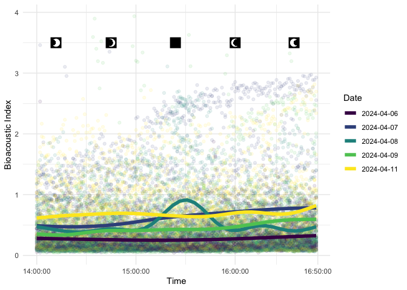

# Analyzing Audio Patterns During the 2024 Total Solar Eclipse

## Project Introduction

This project organizes and models audio data to understand more about
wildlife activity around an eclipse event. Data from the total solar
eclipse on April 8th, 2024 was analyzed using 5 common audiological
indices and generalized additive modeling.

### Data

The data used in this project was collected by Dr. Erika Barthelmess and
other biology students at St. Lawrence University. This team deployed 20
audio recorders in forested wetlands habitats across St. Lawrence
county, New York to sample data between March 30th to April 16th.

## Visuals



Visuals were produced to display the temporal patterns across our five
indices. Along the top are icons which correspond to relevant times
during the eclipse. Here, we have included the visual for the
bioacoustic index, which seems to show an interesting pattern around the
time of totality.

## Data Organization

Using R studio, a function was created to process our .WAV files and
create a cleaned data frame. Using an High Powered Computer, we were
able to iterate this process over all 20 of our audio recorders.

## Model

Our final generalized Additive Model consisted of three terms, and was
used to later create visuals to isolate index patterns across the time
of the eclipse.

$$index \sim  s(hour, by = day)+ day + s(folder, bs = "re")$$

`s()` function refers to the smoothing spline function from the `mgcv`
package

For our models, we used a subset of five days based on weather and
proximity to the day of the eclipse, this ended up being April 6th, 7th,
8th, 9th, and 11th.

Code to create our model is below:

``` r
index_model<- gam(index ~ s(hour, by = day)+ day + s(folder, bs = "re"), data = Eclipse_df)
```

## Findings

From our analysis, we were able to find patterns in three of our indices
that may suggest wildlife audio changes during the eclipse and totality.

- Bioacoustic Index: very noticeable peak around the time of totality,
  with little to no other patterns on April 8th. Certainly a different
  pattern compared to the linearity seen in the other days.

- Acoustic Evenness Index: More complex of a pattern, in the trend line
  for April 8th there is a lot more visible curvature than other days. A
  peak is observed around the time of totality, and this peak is
  surrounded by minimums.

- Acoustic Diversity Index: Again, a lot more curvature visible in our
  trend line for April 8th compared to the other days. Bordering the
  time of totality are two peaks, and between them is a local minimum.
  This minimum falls around the time of peak totality.

For more information on this project and our findings, please view our
[Paper](https://github.com/kmhein21/eclipse_sye/blob/main/Write_Up/Write_up.pdf)
or
[Presentation](https://github.com/kmhein21/eclipse_sye/blob/main/Presentation_files/Festival_Presentation.html).

## Note

In our analysis, we assumed there was no autocorrelation between the
audio clips we were given. This is almost certainly an incorrect
assumption, and so the patterns in our visuals could potentially change
if this autocorrelation was accounted for.
